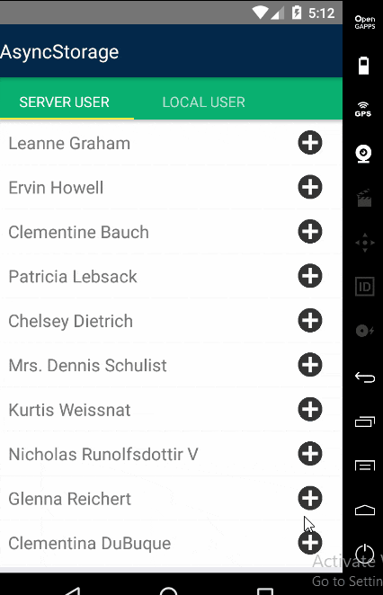

# AsyncStorage-React-Redux-Example
A simple asyncStorage example using react redux react navigation

Output : 

 Find me on Facebook  : [ My Facebook profile link](https://www.facebook.com/morshed.riyad) \
 Find me on  Linkedin  : [My Linkedin profile  link](https://www.linkedin.com/in/monjur-morshed-riyadh-6aaba465/)  \
 Email me : riyadhahmed777@gmail.com